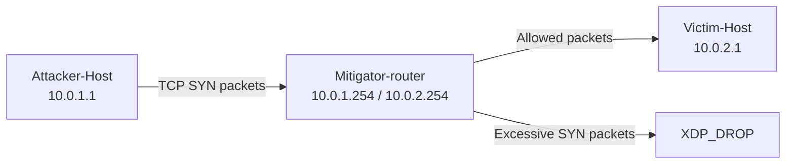

# E9 — SYN Flood Mitigator with eBPF/XDP

## Project Goal

This project implements **E9 — SYN Flood Mitigator** using **eBPF/XDP**.

The XDP program is attached to the **Mitigator-router**. It inspects TCP packets, counts TCP SYN packets, tracks SYN traffic per source IP, and drops excessive SYN packets using `XDP_DROP`.

| Level | Status | Implemented behavior |
|---|---:|---|
| Basic | ✅ | Count incoming TCP SYN packets. |
| Intermediate | ✅ | Track SYN packets per source IP using a BPF map. |
| Advanced | ✅ | Drop SYN packets from sources exceeding the threshold. |

---

## Testbed Topology

```text
╔═══════════════╗        ╔══════════════════╗        ╔═════════════╗
║ Attacker-Host ║ ─────▶ ║ Mitigator-router ║ ─────▶ ║ Victim-Host ║
╚═══════════════╝        ╚══════════════════╝        ╚═════════════╝
    10.0.1.1/24              eth1: 10.0.1.254/24         10.0.2.1/24
    fc00:1::1/64             eth2: 10.0.2.254/24         fc00:2::1/64
                              XDP attached on eth1
```



---

## Current Lab Values

These values match the current repository configuration.

| Item | Current value |
|---|---|
| Lab name | `e9-syn-lab` |
| Topology file | `containerlab/e9-syn-lab.clab.yml` |
| Attacker node | `Attacker-Host` |
| Mitigator node | `Mitigator-router` |
| Victim node | `Victim-Host` |
| Attacker IPv4 | `10.0.1.1/24` |
| Mitigator IPv4 toward attacker | `10.0.1.254/24` |
| Mitigator IPv4 toward victim | `10.0.2.254/24` |
| Victim IPv4 | `10.0.2.1/24` |
| XDP interface on mitigator | `eth1` |
| Victim interface | `eth1` |
| Test TCP port | `80` |

> [!NOTE]
> Containerlab creates Docker container names with the `clab-<lab-name>-<node-name>` format. Because this project uses uppercase node names, the safest method is to detect the real container names after deployment using `docker ps`.

---

## 1. Requirements

Install the required tools on the VM/host:

```bash
sudo apt update
sudo apt install -y docker.io containerlab clang llvm libbpf-dev linux-libc-dev \
  make gcc iproute2 iputils-ping bpftool tcpdump hping3
```

---

## 2. Deploy the Containerlab Topology

From the project root:

```bash
cd projects/e9-syn-flood-mitigator/containerlab
sudo ./deploy.sh
```

Check that the containers are running:

```bash
docker ps --format 'table {{.Names}}\t{{.Status}}'
```

Save the current container names into variables:

```bash
ATTACKER=$(docker ps --format '{{.Names}}' | grep 'Attacker-Host')
MITIGATOR=$(docker ps --format '{{.Names}}' | grep 'Mitigator-router')
VICTIM=$(docker ps --format '{{.Names}}' | grep 'Victim-Host')

VICTIM_IP="10.0.2.1"
XDP_IFACE="eth1"
VICTIM_IFACE="eth1"
VICTIM_PORT="80"
```

Check the detected names:

```bash
echo "$ATTACKER"
echo "$MITIGATOR"
echo "$VICTIM"
```

---

## 3. Connectivity Test Before XDP

Before attaching the XDP program, check that the attacker can reach the victim:

```bash
docker exec "$ATTACKER" ping -c 3 "$VICTIM_IP"
```

Expected result:

```text
The ping should work before the XDP filter is attached.
```

---

## 4. Build the eBPF/XDP Program

From the project directory that contains the `Makefile`:

```bash
make clean
make
```

Check that the object file was created:

```bash
find . -name "*.bpf.o" -o -name "*.o"
```

---

## 5. Copy the XDP Object File to the Mitigator

Replace the object file name if your compiled file has a different name:

```bash
docker cp ./e9_syn_flood.bpf.o "$MITIGATOR":/root/e9_syn_flood.bpf.o
```

If your object file is inside another directory, use this style instead:

```bash
docker cp ./build/e9_syn_flood.bpf.o "$MITIGATOR":/root/e9_syn_flood.bpf.o
```

---

## 6. Attach the XDP Program

Attach the XDP program on the **Mitigator-router interface facing the attacker**:

```bash
docker exec -it "$MITIGATOR" ip link set dev "$XDP_IFACE" xdpgeneric obj /root/e9_syn_flood.bpf.o sec xdp
```

Verify that XDP is attached:

```bash
docker exec -it "$MITIGATOR" bpftool net show

docker exec -it "$MITIGATOR" bpftool prog show
```

> [!TIP]
> Inside containers, `xdpgeneric` is normally safer than native XDP because Containerlab links are virtual Ethernet interfaces.

---

## 7. Test Normal SYN Traffic

Send a small number of TCP SYN packets from the attacker to the victim:

```bash
docker exec -it "$ATTACKER" hping3 -S -c 5 -p "$VICTIM_PORT" "$VICTIM_IP"
```

Expected result:

```text
Normal SYN packets are counted and should pass because they are below the threshold.
```

Check BPF maps:

```bash
docker exec -it "$MITIGATOR" bpftool map show
```

Then dump the relevant map:

```bash
docker exec -it "$MITIGATOR" bpftool map dump id <MAP_ID>
```

---

## 8. Test SYN Flood Traffic

Start tcpdump on the victim:

```bash
docker exec -it "$VICTIM" tcpdump -i "$VICTIM_IFACE" tcp
```

In another terminal, send SYN flood traffic from the attacker:

```bash
docker exec -it "$ATTACKER" hping3 -S --flood -p "$VICTIM_PORT" "$VICTIM_IP"
```

Expected result:

```text
After the threshold is exceeded, the XDP program drops excessive SYN packets.
The victim should receive fewer packets or stop receiving packets from the attacker.
```

---

## 9. Verification Commands

Use these commands on the mitigator:

```bash
docker exec -it "$MITIGATOR" bpftool prog show

docker exec -it "$MITIGATOR" bpftool net show

docker exec -it "$MITIGATOR" bpftool map show

docker exec -it "$MITIGATOR" bpftool map dump id <MAP_ID>
```

Use this command on the victim:

```bash
docker exec -it "$VICTIM" tcpdump -i "$VICTIM_IFACE" tcp
```

---

## 10. Detach XDP

Detach the XDP program from the mitigator:

```bash
docker exec -it "$MITIGATOR" ip link set dev "$XDP_IFACE" xdp off
```

Verify:

```bash
docker exec -it "$MITIGATOR" bpftool net show
```

---

## 11. Destroy the Lab

From the Containerlab directory:

```bash
cd projects/e9-syn-flood-mitigator/containerlab
sudo containerlab destroy -t e9-syn-lab.clab.yml
```

---

## Expected Final Result

```text
Normal TCP SYN packets are allowed.
Excessive SYN packets from the attacker are detected per source IP.
When the source exceeds the threshold, the mitigator returns XDP_DROP.
The victim receives fewer or no SYN packets during the attack.
```

---

## Quick Notes for Evaluators

- The XDP program is attached to `Mitigator-router` on `eth1`.
- The attacker is `Attacker-Host` with IP `10.0.1.1`.
- The victim is `Victim-Host` with IP `10.0.2.1`.
- The test traffic is generated with `hping3`.
- Packet visibility is checked with `tcpdump` on the victim.
- Program and map state are checked with `bpftool`.

